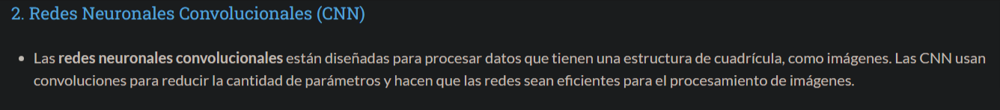
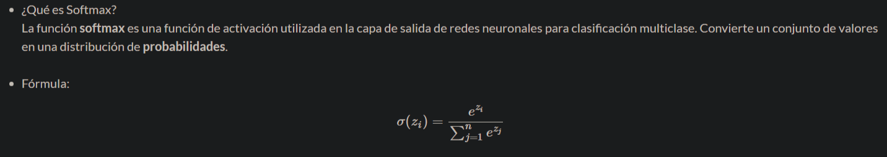

# Actividad Red Neuronal 1

## Nombre: Luis Fernando Chávez Martínez

## Calificación: ______

---

### Modelar una red neuronal que pueda jugar al 5 en línea sin gravedad en un tablero 20*20

#### 1. Definir el tipo de red neuronal y describir cada una de sus partes

En el modelo podemos usar un red neuronal convolucional ya que estas se procesan los datos en una cuadricula.

**Descripciones de sus partes:**

- **Primera capa (entrada)** Los valores el tablero en este caso una matriz de 20*20.
- **Segunda y Tercera capa (ocultas):** Se deben utilizar multiples redes para la ejecución debido a la extensa cantidad de datos.
- **Cuarta capa (salida):** Ya que nos referimos a un tablero podemos poner las 400 salidas de cada posición del tablero.

#### 2. Definir los patrones a utilizar

Ya que nos referimos al juego 5 en linea los patrones a utilizar son:

- Lineas consecutivas del mismo color.
- 5 fichas consecutivas en cualquier dirección (horizontal, vertical y diagonal).
- Invalidar 5 fichas consecutivas de distintos colores.
- Impedir reemplazo de fichas ya colocadas.
- Una sola ficha por turno.

#### 3. Definir la función de activación necesaria para este problema

En la capa de salida se puede utilizar **softmax** para convertir las probabilidades en movimientos posibles que puede realizar cada jugador en cada turno.

#### 4. Definir el número máximo de entradas

El tablero ya esta definido como **20*20** por lo que tiene **400 casillas**, por lo tanto el numero máximo de entradas es de igual manera de **400**.

#### 5. ¿Qué valores a la salida de la red se podrían esperar?

La salida debe de ser siempre una probabilidad debido a que cada jugador selecciona una casilla jugable y debido a la naturaleza del juego puede tomar cualquier casilla de las 400 posibles donde la estrategia del jugador desdirá la victoria.

#### 6. ¿Cuáles son los valores máximos que puede tener el bias?

---
